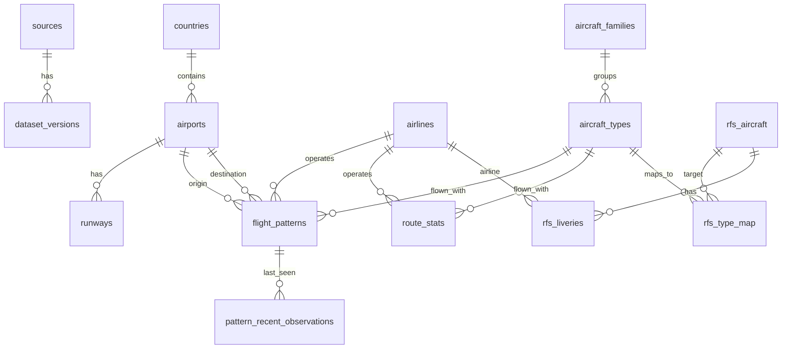

# DATABASE_SCHEMA.md — Schéma des données du Flight Finder

Version 0.1 — 2026-09-30

## 1. Principes

1. **Trois niveaux de données**, jamais mélangés :
   - **Staging** (DuckDB, non livré) : vols observés bruts, plusieurs dizaines de millions de lignes. Vit sur la machine qui exécute l'ETL.
   - **`aviation.sqlite`** (livré au serveur, lecture seule) : aéroports, pistes, compagnies, types d'avion, agrégats de routes et de patterns. **Dérivée de données ODbL** → voir DATA_SOURCES.md §12.
   - **`rfs_compat.sqlite`** (livré au serveur, lecture seule) : compatibilité RFS, tenue à la main. **Propriétaire.** Fichier séparé volontairement.
2. **Provenance partout.** Chaque table porte `source_id` ou `dataset_version_id`. Chaque valeur exposée à l'utilisateur a un statut : `OBSERVED`, `STATIC_DB`, `DERIVED`, `ESTIMATE`, `USER_INPUT`, `VERIFIED`, `UNKNOWN`.
3. **Rien n'est inventé.** Une valeur inconnue est `NULL`, jamais une valeur par défaut plausible.
4. **Horodatages en ISO-8601 UTC** (`2026-09-30T14:05:00Z`), stockés en `TEXT`. Les fuseaux sont stockés comme **identifiants IANA**, jamais comme décalages.
5. **Clés métier** : aéroport = code ICAO (clé technique : `airport_id` d'OurAirports, stable) ; compagnie = code ICAO ; avion = code type ICAO.

Les noms de colonnes des fichiers sources ci-dessous reprennent la documentation officielle. Ceux de MrAirspace viennent du README et **doivent être confirmés** par `DESCRIBE` sur un vrai fichier (CODEX_TASK, étape 1).

## 2. Diagramme des relations



(`rfs_*` vivent dans `rfs_compat.sqlite` ; les liens vers `aviation.sqlite` passent par des **codes** — `type_icao`, `airline_icao` — pas par des clés étrangères inter-fichiers.)

## 3. Staging DuckDB (ETL uniquement)

```sql
-- Vue brute sur les Parquet MrAirspace (une ou deux releases trimestrielles)
CREATE OR REPLACE VIEW raw_flights AS
SELECT * FROM read_parquet('data/finder/raw/mrairspace/*.parquet', union_by_name = true, filename = true);
```

Table de staging normalisée (produite par l'ETL, non livrée) :

```sql
CREATE TABLE stg_flights (
  icao_hex            VARCHAR,
  registration        VARCHAR,
  type_icao           VARCHAR,
  type_description    VARCHAR,
  type_detailed       VARCHAR,          -- NULL si absent (colonne depuis 2026 Q1)
  airline_icao        VARCHAR,
  callsign            VARCHAR,
  origin_icao         VARCHAR,          -- aéroport résolu
  dest_icao           VARCHAR,
  dep_utc             TIMESTAMP,        -- décollage (ou début de trace si incomplet)
  arr_utc             TIMESTAMP,        -- toucher (ou fin de trace si incomplet)
  dep_on_ground       BOOLEAN,          -- Track_Origin_FL_Ft = 'ground'
  arr_on_ground       BOOLEAN,
  is_complete         BOOLEAN,          -- dep_on_ground AND arr_on_ground
  resolution          VARCHAR,          -- 'TRACK' | 'CALLSIGN_VALIDATED' (sinon ligne rejetée)
  file_quarter        VARCHAR,          -- '2026_Q2'
  dataset_version_id  INTEGER
);
```

Colonnes MrAirspace → staging :

| MrAirspace | Staging | Règle |
|---|---|---|
| `ICAO_Hex` | `icao_hex` | tel quel |
| `Reg` | `registration` | tel quel |
| `AC_Type` | `type_icao` | majuscules, trim |
| `AC_Type_Description` | `type_description` | sert à déduire le constructeur |
| `AC_Type_Detailed` | `type_detailed` | optionnel ; non utilisé en filtre en Phase 1 |
| `Airline` | `airline_icao` | doit exister dans `airlines.icao` sinon rejeté |
| `Callsign` | `callsign` | majuscules, trim |
| `Track_Origin_DateTime_UTC` | `dep_utc` | `try_cast` en timestamp ; `'-'` → NULL → ligne rejetée |
| `Track_Destination_DateTime_UTC` | `arr_utc` | idem |
| `Track_Origin_FL_Ft` / `Track_Destination_FL_Ft` | `dep_on_ground` / `arr_on_ground` | `= 'ground'` |
| `Track_*_ApplicableAirports` | résolution d'aéroport | voir §3.1 |
| `Route_Validation_Based_on_Callsign` | résolution d'aéroport | voir §3.1 |

### 3.1 Règle de résolution d'aéroport (par extrémité de vol)

```
candidats = liste d'ICAO dans Track_*_ApplicableAirports     # délimiteur à déterminer sur données réelles
validation = paire (origine, destination) lue dans Route_Validation_Based_on_Callsign  # idem

1. Si len(candidats) == 1 ET FL == 'ground'          → aéroport = candidat, resolution = 'TRACK'
2. Sinon, si validation existe ET l'extrémité correspondante de la validation
   appartient à candidats (ou candidats est vide/'-')  → aéroport = validation, resolution = 'CALLSIGN_VALIDATED'
3. Sinon                                              → vol REJETÉ (compté dans les métriques de rejet)
```

Les vols rejetés ne sont jamais "réparés" par une supposition. Les métriques de rejet (par raison) sont écrites dans `etl_report.json` à chaque build.

### 3.2 Filtres de qualité du staging

- `airline_icao` présent dans `airlines`.
- `origin_icao != dest_icao`.
- Durée `(arr_utc - dep_utc)` entre 15 minutes et 20 heures (valeurs configurables).
- `callsign` non vide.
- Chevauchement de trimestres : ne garder que les lignes dont le **mois de `dep_utc`** appartient au trimestre du fichier (ne pas utiliser `DISTINCT`).
- Dédoublonnage des doublons de liaison de traces : clé `(icao_hex, dep_utc arrondi à la minute, origin_icao, dest_icao)`.
- Le staging conserve `is_complete`. Les **durées** ne sont calculées que sur les vols complets ; le **nombre d'observations** inclut les vols incomplets.

## 4. `aviation.sqlite` — DDL

```sql
PRAGMA foreign_keys = ON;
PRAGMA user_version = 1;           -- version de schéma

-- ---------- Provenance ----------
CREATE TABLE sources (
  source_id        TEXT PRIMARY KEY,         -- 'ourairports','vrs','mrairspace','tzboundaries'
  name             TEXT NOT NULL,
  url              TEXT NOT NULL,
  license_spdx     TEXT NOT NULL,            -- 'Unlicense','CC0-1.0','ODbL-1.0'
  share_alike      INTEGER NOT NULL CHECK (share_alike IN (0,1)),
  attribution_text TEXT NOT NULL,
  notes            TEXT
);

CREATE TABLE dataset_versions (
  dataset_version_id INTEGER PRIMARY KEY,
  source_id          TEXT NOT NULL REFERENCES sources(source_id),
  version_label      TEXT NOT NULL,          -- '2026_Q2' | '2026-09-28'
  retrieved_at       TEXT NOT NULL,          -- ISO-8601 UTC
  covers_from        TEXT,                   -- pour les observations : 1re date couverte
  covers_to          TEXT,
  row_count          INTEGER,
  sha256             TEXT,
  UNIQUE (source_id, version_label)
);

-- ---------- Géographie ----------
CREATE TABLE countries (
  iso2       TEXT PRIMARY KEY,
  name       TEXT NOT NULL,
  continent  TEXT NOT NULL CHECK (continent IN ('AF','AN','AS','EU','NA','OC','SA')),
  source_id  TEXT NOT NULL REFERENCES sources(source_id)
);

CREATE TABLE airports (
  airport_id          INTEGER PRIMARY KEY,   -- = id OurAirports (stable)
  ident               TEXT NOT NULL UNIQUE,  -- ICAO si disponible, sinon code local
  icao                TEXT,                  -- NULL si l'aéroport n'en a pas
  iata                TEXT,
  name                TEXT NOT NULL,
  type                TEXT NOT NULL,         -- large_airport, medium_airport, ...
  latitude_deg        REAL NOT NULL,
  longitude_deg       REAL NOT NULL,
  elevation_ft        INTEGER,
  iso_country         TEXT NOT NULL REFERENCES countries(iso2),
  iso_region          TEXT,
  municipality        TEXT,
  continent_raw       TEXT,                  -- valeur OurAirports
  continent           TEXT NOT NULL,         -- après continent_overrides
  scheduled_service   INTEGER NOT NULL DEFAULT 0,
  tz_iana             TEXT,                  -- NULL = inconnu (jamais deviné)
  tz_source           TEXT,                  -- 'timezonefinder=<v>;data=<v>' | 'manual'
  dataset_version_id  INTEGER NOT NULL REFERENCES dataset_versions(dataset_version_id)
);
CREATE UNIQUE INDEX uq_airports_icao ON airports(icao) WHERE icao IS NOT NULL;
CREATE INDEX ix_airports_iata    ON airports(iata);
CREATE INDEX ix_airports_country ON airports(iso_country);
CREATE INDEX ix_airports_cont    ON airports(continent);

CREATE TABLE runways (
  runway_id            INTEGER PRIMARY KEY,  -- = id OurAirports
  airport_id           INTEGER NOT NULL REFERENCES airports(airport_id),
  length_ft            INTEGER,
  width_ft             INTEGER,
  surface              TEXT,
  lighted              INTEGER,
  closed               INTEGER,
  le_ident             TEXT, le_heading_true REAL, le_latitude_deg REAL, le_longitude_deg REAL,
  le_elevation_ft      INTEGER, le_displaced_threshold_ft INTEGER,
  he_ident             TEXT, he_heading_true REAL, he_latitude_deg REAL, he_longitude_deg REAL,
  he_elevation_ft      INTEGER, he_displaced_threshold_ft INTEGER,
  dataset_version_id   INTEGER NOT NULL REFERENCES dataset_versions(dataset_version_id)
);
CREATE INDEX ix_runways_airport ON runways(airport_id);

-- Correctifs et regroupements maintenus par nous (fichiers CSV versionnés)
CREATE TABLE continent_overrides (
  icao_or_ident TEXT PRIMARY KEY,
  continent     TEXT NOT NULL CHECK (continent IN ('AF','AN','AS','EU','NA','OC','SA')),
  reason        TEXT NOT NULL
);

CREATE TABLE geo_groups (                     -- 'EU27','EEA','ECAC','GEOGRAPHIC_EUROPE',...
  group_id   TEXT PRIMARY KEY,
  label_key  TEXT NOT NULL                    -- clé i18n, jamais un texte en dur
);
CREATE TABLE geo_group_members (
  group_id TEXT NOT NULL REFERENCES geo_groups(group_id),
  iso2     TEXT NOT NULL REFERENCES countries(iso2),
  PRIMARY KEY (group_id, iso2)
);

-- Recherche d'aéroports (autocomplétion)
CREATE VIRTUAL TABLE airport_search USING fts5 (
  icao, iata, name, municipality, keywords,
  content = '', tokenize = 'unicode61 remove_diacritics 2'
);

-- ---------- Compagnies et avions ----------
CREATE TABLE airlines (
  airline_id     INTEGER PRIMARY KEY,
  icao           TEXT NOT NULL UNIQUE,
  iata           TEXT,                        -- non unique garanti → index simple
  name           TEXT NOT NULL,
  radio_callsign TEXT,
  country_iso2   TEXT,
  source_id      TEXT NOT NULL REFERENCES sources(source_id)
);
CREATE INDEX ix_airlines_iata ON airlines(iata);

CREATE TABLE airline_aliases (               -- 'air india', 'ai', 'aic'
  alias_norm  TEXT NOT NULL,                  -- minuscules, sans accents
  airline_id  INTEGER NOT NULL REFERENCES airlines(airline_id),
  PRIMARY KEY (alias_norm, airline_id)
);

CREATE TABLE aircraft_families (              -- 'A320FAM','A330FAM','B737NG',... (maintenu par nous)
  family_id    TEXT PRIMARY KEY,
  name         TEXT NOT NULL,
  manufacturer TEXT NOT NULL
);

CREATE TABLE aircraft_types (
  type_icao    TEXT PRIMARY KEY,              -- 'A20N','A21N','B738',...
  manufacturer TEXT,
  model        TEXT,
  description  TEXT,
  family_id    TEXT REFERENCES aircraft_families(family_id),
  category     TEXT NOT NULL DEFAULT 'UNKNOWN' CHECK (category IN ('PAX','CARGO','MIXED','UNKNOWN')),
  source_id    TEXT NOT NULL REFERENCES sources(source_id)
);
CREATE INDEX ix_types_family ON aircraft_types(family_id);
CREATE INDEX ix_types_manuf  ON aircraft_types(manufacturer);

CREATE TABLE aircraft_type_aliases (         -- 'a321neo','a21n','a321 neo'
  alias_norm TEXT NOT NULL,
  type_icao  TEXT NOT NULL REFERENCES aircraft_types(type_icao),
  PRIMARY KEY (alias_norm, type_icao)
);

-- ---------- Agrégats de vols observés ----------
-- Granularité route : "quelles routes réelles existent pour cette compagnie et ce type ?"
CREATE TABLE route_stats (
  airline_id          INTEGER NOT NULL REFERENCES airlines(airline_id),
  origin_airport_id   INTEGER NOT NULL REFERENCES airports(airport_id),
  dest_airport_id     INTEGER NOT NULL REFERENCES airports(airport_id),
  type_icao           TEXT    NOT NULL REFERENCES aircraft_types(type_icao),
  n_obs               INTEGER NOT NULL CHECK (n_obs > 0),
  n_complete          INTEGER NOT NULL CHECK (n_complete BETWEEN 0 AND n_obs),
  first_seen_utc      TEXT NOT NULL,
  last_seen_utc       TEXT NOT NULL,
  dur_p10_min         REAL,                   -- NULL si n_complete < min_complete
  dur_median_min      REAL,
  dur_p90_min         REAL,
  distance_nm         REAL NOT NULL,          -- grand cercle, sur coordonnées des aéroports
  dataset_version_id  INTEGER NOT NULL REFERENCES dataset_versions(dataset_version_id),
  PRIMARY KEY (airline_id, origin_airport_id, dest_airport_id, type_icao)
) WITHOUT ROWID;
CREATE INDEX ix_rs_origin ON route_stats(origin_airport_id);
CREATE INDEX ix_rs_dest   ON route_stats(dest_airport_id);
CREATE INDEX ix_rs_type   ON route_stats(type_icao);

-- Granularité "vol" : un callsign opéré sur une paire d'aéroports, avec son horaire local typique
CREATE TABLE flight_patterns (
  pattern_id            INTEGER PRIMARY KEY,
  airline_id            INTEGER NOT NULL REFERENCES airlines(airline_id),
  callsign              TEXT    NOT NULL,
  flight_number_iata    TEXT,                 -- déduit du callsign, sinon NULL
  flight_number_source  TEXT NOT NULL DEFAULT 'NONE'
                        CHECK (flight_number_source IN ('DERIVED_FROM_CALLSIGN','NONE')),
  origin_airport_id     INTEGER NOT NULL REFERENCES airports(airport_id),
  dest_airport_id       INTEGER NOT NULL REFERENCES airports(airport_id),
  type_icao             TEXT    NOT NULL REFERENCES aircraft_types(type_icao),   -- type le plus fréquent
  type_mix_json         TEXT,                 -- {"A21N":17,"A320":3} si plusieurs types observés
  n_obs                 INTEGER NOT NULL,
  n_complete            INTEGER NOT NULL,
  n_active_days         INTEGER NOT NULL,     -- jours distincts (date locale à l'origine)
  weekday_mask          INTEGER NOT NULL CHECK (weekday_mask BETWEEN 0 AND 127),
                        -- bit0=lundi … bit6=dimanche, jour de la semaine en date LOCALE à l'origine
  dep_local_min_median  INTEGER CHECK (dep_local_min_median BETWEEN 0 AND 1439),
                        -- minute du jour, heure LOCALE à l'origine, médiane CIRCULAIRE
  dep_local_min_spread  INTEGER,              -- écart interquartile circulaire, en minutes
  dur_p10_min           REAL,
  dur_median_min        REAL,
  dur_p90_min           REAL,
  distance_nm           REAL NOT NULL,
  resolution_mix_json   TEXT NOT NULL,        -- {"TRACK":18,"CALLSIGN_VALIDATED":2}
  first_seen_utc        TEXT NOT NULL,
  last_seen_utc         TEXT NOT NULL,
  window_start_utc      TEXT NOT NULL,
  window_end_utc        TEXT NOT NULL,
  dataset_version_id    INTEGER NOT NULL REFERENCES dataset_versions(dataset_version_id),
  UNIQUE (airline_id, callsign, origin_airport_id, dest_airport_id, dep_local_min_median)
);
CREATE INDEX ix_fp_airline ON flight_patterns(airline_id);
CREATE INDEX ix_fp_origin  ON flight_patterns(origin_airport_id);
CREATE INDEX ix_fp_dest    ON flight_patterns(dest_airport_id);
CREATE INDEX ix_fp_type    ON flight_patterns(type_icao);
CREATE INDEX ix_fp_dur     ON flight_patterns(dur_median_min);
CREATE INDEX ix_fp_dist    ON flight_patterns(distance_nm);

-- 5 dernières observations par pattern, pour l'affichage de fraîcheur
CREATE TABLE pattern_recent_observations (
  pattern_id   INTEGER NOT NULL REFERENCES flight_patterns(pattern_id),
  dep_utc      TEXT NOT NULL,
  arr_utc      TEXT NOT NULL,
  type_icao    TEXT NOT NULL,
  is_complete  INTEGER NOT NULL,
  resolution   TEXT NOT NULL,
  PRIMARY KEY (pattern_id, dep_utc)
) WITHOUT ROWID;
```

Pièges à traiter dans l'ETL (et à tester) :

- **Médiane circulaire.** Un vol à 23:50 et 00:10 locales a une médiane autour de minuit, pas de 12:00. Utiliser une moyenne/médiane circulaire (angles sur 1 440 minutes).
- **Jour de la semaine en date locale à l'origine**, jamais en UTC. Un départ à 00:30 local est la veille en UTC.
- **Heure locale à l'origine** calculée avec `origin.tz_iana` à la date du vol (l'heure d'été déplace l'UTC mais pas l'horaire local de la compagnie). C'est ce qui permet de projeter correctement un pattern sur une date future.
- **Nombre d'observations** ≠ nombre de jours : un même callsign peut voler deux fois par jour ; `n_active_days` porte l'information de régularité.

## 5. `rfs_compat.sqlite` — DDL (propriétaire)

```sql
PRAGMA user_version = 1;

CREATE TABLE rfs_aircraft (
  rfs_aircraft_id  TEXT PRIMARY KEY,          -- slug stable : 'a320neo', 'b737-800'
  display_name     TEXT NOT NULL,             -- tel qu'affiché dans RFS
  manufacturer     TEXT,
  verified         INTEGER NOT NULL DEFAULT 0 CHECK (verified IN (0,1)),
  verified_date    TEXT,                      -- ISO date
  source           TEXT,                      -- 'rfs-app-screenshot-2026-09-30', 'rfs-wiki', 'community:<pseudo>'
  notes            TEXT
);

CREATE TABLE rfs_type_map (                   -- type ICAO du monde réel → modèle RFS
  type_icao        TEXT NOT NULL,             -- code, pas de FK inter-fichiers
  rfs_aircraft_id  TEXT NOT NULL REFERENCES rfs_aircraft(rfs_aircraft_id),
  match_quality    TEXT NOT NULL CHECK (match_quality IN ('EXACT','CLOSE_VARIANT','SUBSTITUTE')),
  verified         INTEGER NOT NULL DEFAULT 0 CHECK (verified IN (0,1)),
  verified_date    TEXT,
  source           TEXT,
  notes            TEXT,
  PRIMARY KEY (type_icao, rfs_aircraft_id)
);

CREATE TABLE rfs_liveries (
  livery_id        INTEGER PRIMARY KEY,
  rfs_aircraft_id  TEXT NOT NULL REFERENCES rfs_aircraft(rfs_aircraft_id),
  airline_icao     TEXT,                      -- NULL pour une livery générique
  livery_name      TEXT NOT NULL,             -- tel qu'affiché dans RFS
  livery_kind      TEXT NOT NULL DEFAULT 'UNKNOWN' CHECK (livery_kind IN ('REAL','VIRTUAL','CUSTOM','UNKNOWN')),
  verified         INTEGER NOT NULL DEFAULT 0 CHECK (verified IN (0,1)),
  verified_date    TEXT,
  source           TEXT NOT NULL,             -- obligatoire : qui a vérifié, comment
  notes            TEXT
);
CREATE INDEX ix_liv_ac_air ON rfs_liveries(rfs_aircraft_id, airline_icao);
```

Règle d'affichage, **imposée par le code de recherche** :

| Situation | Affichage |
|---|---|
| `rfs_type_map.verified = 1` | "Compatible RFS (vérifié le …)" |
| ligne présente, `verified = 0` | "Correspondance probable, non vérifiée" |
| aucune ligne | "Inconnu" (et non "incompatible") |
| livery `verified = 1` | "Livery disponible (vérifiée le …)" |
| aucune ligne livery | "Livery non vérifiée" |

Le filtre "RFS compatible seulement" ne retient que `verified = 1`. Un filtre "livery vérifiée seulement" renvoie zéro résultat tant que la table est vide — c'est le comportement correct, et l'interface doit dire pourquoi.

## 6. Métadonnées de build (`aviation.sqlite`)

```sql
CREATE TABLE build_info (
  key TEXT PRIMARY KEY, value TEXT NOT NULL
);
-- clés : schema_version, built_at_utc, etl_git_sha, tzdata_version, timezonefinder_version,
--        window_days, min_obs_pattern, min_obs_route, rows_patterns, rows_routes, rejects_json
```

`/api/finder/meta` expose `build_info` et `dataset_versions` au front (fraîcheur, attributions).

## 7. Vue de recherche

```sql
CREATE VIEW v_pattern_search AS
SELECT
  p.pattern_id, p.callsign, p.flight_number_iata, p.flight_number_source,
  p.airline_id, a.icao AS airline_icao, a.iata AS airline_iata, a.name AS airline_name,
  p.type_icao, t.manufacturer, t.family_id,
  p.origin_airport_id, o.icao AS origin_icao, o.iata AS origin_iata, o.iso_country AS origin_country,
  o.continent AS origin_continent, o.tz_iana AS origin_tz, o.latitude_deg AS origin_lat, o.longitude_deg AS origin_lon,
  p.dest_airport_id,   d.icao AS dest_icao,   d.iata AS dest_iata,   d.iso_country AS dest_country,
  d.continent AS dest_continent, d.tz_iana AS dest_tz,
  p.n_obs, p.n_complete, p.n_active_days, p.weekday_mask,
  p.dep_local_min_median, p.dep_local_min_spread,
  p.dur_p10_min, p.dur_median_min, p.dur_p90_min, p.distance_nm,
  p.first_seen_utc, p.last_seen_utc, p.window_start_utc, p.window_end_utc,
  p.dataset_version_id
FROM flight_patterns p
JOIN airlines a       ON a.airline_id = p.airline_id
JOIN aircraft_types t ON t.type_icao  = p.type_icao
JOIN airports o       ON o.airport_id = p.origin_airport_id
JOIN airports d       ON d.airport_id = p.dest_airport_id;
```

## 8. Contrat `SelectedFlight` (partagé entre Finder, Fuel, ATC/Discord)

C'est **le seul objet** que les autres modules lisent. Contrat indépendant du langage : JSON Schema (à stocker dans `schemas/selected_flight.schema.json`).

```json
{
  "$schema": "https://json-schema.org/draft/2020-12/schema",
  "$id": "selected_flight.v1",
  "type": "object",
  "required": ["schema_version", "selected_at_utc", "airline", "aircraft", "origin", "destination", "provenance"],
  "properties": {
    "schema_version": { "const": 1 },
    "selected_at_utc": { "type": "string", "format": "date-time" },
    "pattern_id": { "type": ["integer", "null"] },
    "dataset_version_ids": { "type": "array", "items": { "type": "integer" } },

    "airline": {
      "type": "object",
      "properties": {
        "icao": { "type": ["string", "null"] }, "iata": { "type": ["string", "null"] }, "name": { "type": ["string", "null"] }
      }
    },
    "callsign": { "type": ["string", "null"] },
    "flight_number_iata": { "type": ["string", "null"] },

    "aircraft": {
      "type": "object",
      "properties": {
        "type_icao": { "type": ["string", "null"] },
        "display_name": { "type": ["string", "null"] },
        "rfs_aircraft_id": { "type": ["string", "null"] },
        "rfs_compat": { "enum": ["VERIFIED", "UNVERIFIED", "UNKNOWN"] }
      }
    },

    "origin":      { "$ref": "#/$defs/airport_ref" },
    "destination": { "$ref": "#/$defs/airport_ref" },

    "distance_nm":        { "$ref": "#/$defs/measured_number" },
    "duration_airborne_min": { "$ref": "#/$defs/measured_number" },

    "times": {
      "type": "object",
      "properties": {
        "departure_utc": { "type": ["string", "null"], "format": "date-time" },
        "arrival_utc":   { "type": ["string", "null"], "format": "date-time" },
        "basis": { "enum": ["SIM_START", "PATTERN_BASED", "USER_INPUT", "UNKNOWN"] }
      }
    },

    "cruise_level":   { "$ref": "#/$defs/measured_number" },
    "runway_departure": { "$ref": "#/$defs/runway_choice" },
    "runway_arrival":   { "$ref": "#/$defs/runway_choice" },
    "passengers": { "$ref": "#/$defs/measured_number" },
    "cargo_kg":   { "$ref": "#/$defs/measured_number" },

    "provenance": { "type": "object", "additionalProperties": { "$ref": "#/$defs/status" } }
  },

  "$defs": {
    "status": { "enum": ["OBSERVED", "STATIC_DB", "DERIVED", "ESTIMATE", "USER_INPUT", "VERIFIED", "UNKNOWN"] },
    "measured_number": {
      "type": "object",
      "required": ["value", "status"],
      "properties": {
        "value": { "type": ["number", "null"] },
        "status": { "$ref": "#/$defs/status" },
        "note": { "type": ["string", "null"] }
      }
    },
    "airport_ref": {
      "type": "object",
      "required": ["icao"],
      "properties": {
        "icao": { "type": "string" }, "iata": { "type": ["string", "null"] }, "name": { "type": "string" },
        "country": { "type": "string" }, "tz_iana": { "type": ["string", "null"] },
        "runways_available": { "type": "array", "items": { "type": "string" } }
      }
    },
    "runway_choice": {
      "type": "object",
      "required": ["value", "status"],
      "properties": {
        "value": { "type": ["string", "null"] },
        "status": { "enum": ["USER_INPUT", "VERIFIED", "LIKELY", "UNKNOWN"] },
        "note": { "type": ["string", "null"] }
      }
    }
  }
}
```

**Règles d'injection dans Discord / Fuel (vérifiées par tests) :**

1. Un champ dont le `status` est `ESTIMATE`, `LIKELY` ou `UNKNOWN` **n'est jamais** inséré automatiquement dans un message Discord. Le champ est laissé vide et l'interface demande une saisie.
2. `runway_*` n'est utilisable dans un message que si `status ∈ {USER_INPUT, VERIFIED}`.
3. `passengers`, `cargo_kg` et `cruise_level` sont `UNKNOWN` par défaut ; seuls `USER_INPUT` les remplit.
4. Toute chaîne issue des données (callsign, nom d'aéroport) est échappée avant insertion dans un message Discord (markdown et mentions `@`).

## 9. Volumétrie (hypothèses de travail, à mesurer au premier build)

Ces chiffres ne sont **pas** vérifiés ; l'ETL doit écrire les tailles réelles dans `etl_report.json`.

| Table | Ordre de grandeur attendu |
|---|---|
| airports | ≈ 80 000 (dont seulement une fraction avec ICAO et trafic commercial) |
| runways | ≈ 48 000 |
| airlines | quelques milliers |
| flight_patterns | de quelques dizaines de milliers à quelques centaines de milliers, selon la fenêtre et `min_obs` |
| route_stats | même ordre |
| Fichier `aviation.sqlite` | à mesurer ; objectif de travail : moins de 500 Mo |
