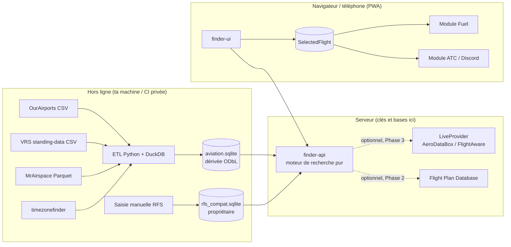

# RFS_FLIGHT_FINDER_SPEC.md — Spécification du Flight Finder

Version 0.1 — 2026-09-30 — statut : brouillon à valider

Documents liés : DATA_SOURCES.md · DATABASE_SCHEMA.md · SEARCH_ENGINE.md · CODEX_TASK.md

---

## 0. Résumé

Le Flight Finder est un module **séparé** de ton application RFS. Il trouve des vols réels plausibles selon les critères d'un joueur, sans IA à l'exécution.

L'IA sert à construire le programme. À l'exécution, tout est déterministe : une base SQLite agrégée, des filtres SQL, des calculs de fuseaux avec IANA, et un scoring à formule fixe.

La base est construite hors ligne par un pipeline ETL (Python + DuckDB) à partir de trois sources ouvertes : OurAirports (aéroports, pistes), MrAirspace (vols observés par ADS-B) et VRS standing-data (compagnies, validation de routes). Un clic sur **USE THIS FLIGHT** place le vol dans un objet partagé `SelectedFlight`, lu ensuite par le module Fuel et par le générateur de messages Discord/ATC.

---

## 1. Périmètre de la vérification

| Élément | État |
|---|---|
| Projet existant (framework, structure) | **Non inspecté.** Aucun fichier n'est arrivé dans l'espace de travail (dossier d'uploads vide). Toutes les décisions liées à la pile technique sont donc conditionnelles ; CODEX_TASK.md commence par un audit du dépôt. |
| Sources de données | Documentation et licences lues en ligne. **Aucun dataset téléchargé.** |
| CGU Rortos, AeroDataBox, FlightAware, adsbdb | Extraits et citations tierces seulement. Voir DATA_SOURCES.md §16. |

---

## 2. Ce qui doit changer dans l'idée de départ

Tu as demandé de dire clairement ce qui n'est pas réaliste. Voici les points, avec la décision retenue.

| # | Idée initiale | Réalité constatée | Décision |
|---|---|---|---|
| 1 | "Vols réels programmés, horaires" | Les données gratuites sont des **vols observés** par ADS-B (décollage/toucher), pas des horaires de compagnie. | Libellés "observé" et "basé sur un pattern observé". Jamais "scheduled". Une route est "réelle" si elle a été vue au moins N fois sur la fenêtre. |
| 2 | "Durée de vol ≈ 10 h" | La durée calculable est **décollage → atterrissage**. Ce n'est ni le temps bloc, ni une durée garantie dans RFS (vent, route, procédures, vitesse). | Champ `DURATION_IS_AIRBORNE` toujours affiché. L'utilisateur ou le module Fuel peut la remplacer. |
| 3 | Départ dans 30 min + arrivée demain 07:00 + durée ≈ 10 h | Ces trois critères sont **redondants** : deux d'entre eux fixent le troisième, et ils peuvent se contredire. | Le moteur dérive la durée (arrivée − départ) et signale `TIME_INCONSISTENT` si ta durée explicite diverge. |
| 4 | Recherche Afrique → Asie | La couverture ADS-B est inégale ; elle s'améliore mais reste limitée. Moins de résultats, plus d'incertitude. | Avertissement `LOW_COVERAGE_REGION` ; le moteur ne comble jamais avec des routes inventées. |
| 5 | "Exclure l'Europe" | "Europe" est ambigu (continent géographique, UE, EEE, CEAC ; Russie, Turquie, Caucase en limite). Et exclure "à l'un ou l'autre bout" retire aussi les vols *vers* l'Europe. | Groupes géographiques explicites ; `continent_overrides` ; l'interface affiche combien de candidats l'exclusion élimine. |
| 6 | Compatibilité liveries RFS | Il n'existe pas de liste publique officielle machine-lisible. Les liveries peuvent en plus être créées par des joueurs et changent. | Tables `rfs_*` tenues à la main, `verified` + `verified_date` + `source`. Inconnu ≠ incompatible. Hors Phase 1 pour les liveries. |
| 7 | Pistes en service | Les données publiques donnent les pistes qui **existent**, pas celle utilisée. | Phase 1 : liste des pistes seulement. "Likely runway" (Phase 2) sera étiqueté comme tel et jamais injecté dans Discord. |
| 8 | Passagers / cargo réels | Non disponibles publiquement (l'auteur de MrAirspace ne les propose que sur demande). | Saisie utilisateur uniquement. Toute estimation = `ESTIMATE`, jamais insérée dans un message Discord. |
| 9 | "Protéger la logique côté serveur" | Partiellement possible. Le front est toujours visible ; le serveur peut cacher le code et les données **propres**, pas les données ouvertes. Et l'ODbL impose des obligations. | Voir §9 et DATA_SOURCES.md §12. |
| 10 | "Aucune API payante pour la fonction principale" | Réalisable. Mais une fonction Live partagée dans une communauté sort vite du palier gratuit de FlightAware (usage personnel uniquement) et dépend des CGU de cache d'AeroDataBox. | Live = Phase 3, optionnelle, derrière une interface et un drapeau. |
| 11 | "Base statique de routes réelles" | OpenFlights a des routes gelées depuis juin 2014. | Non retenu pour les routes. |

---

## 3. Architecture



### 3.1 Composants

| Composant | Rôle | Emplacement (à adapter après audit) |
|---|---|---|
| `finder-etl` | Télécharge, valide, agrège, écrit `aviation.sqlite` et `etl_report.json` | `tools/finder_etl/` |
| `aviation.sqlite` | Données ouvertes agrégées, lecture seule | Serveur uniquement |
| `rfs_compat.sqlite` | Compatibilité RFS vérifiée | Serveur uniquement |
| `finder-api` | Validation d'entrée, SQL, scoring, réponses | Module du backend |
| `finder-ui` | Formulaire, résultats, détail, bouton USE THIS FLIGHT | Module du front |
| `selected-flight` | Contrat et magasin d'état partagé | Module partagé minimal |
| `LiveProvider` | Interface de vérification live, désactivée par défaut | Phase 3 |

### 3.2 Règles de modularité

1. **Dépendance à sens unique.** Fuel et ATC lisent `SelectedFlight`. Le Finder ne connaît ni Fuel ni ATC.
2. **Le Finder peut tomber sans casser le reste.** Drapeau de fonctionnalité, limite d'erreur côté UI, route API isolée.
3. **Aucune table du Finder n'est utilisée par les autres modules.** Ils passent par le contrat.
4. **Le cœur du moteur est une fonction pure** (SEARCH_ENGINE.md §1) : testable sans serveur, sans réseau, sans horloge système.
5. **Stack-agnostique.** Les choix de langage, d'hébergement et de framework sont différés à l'audit du dépôt.

---

## 4. Fonctionnalités par phase

**M** = indispensable · **S** = souhaitable si le temps le permet · **—** = absent.

| Fonction | Phase 1 | Phase 2 | Phase 3 |
|---|---|---|---|
| Pipeline ETL + `aviation.sqlite` | M | | |
| Filtres : compagnie, avion (exact/famille/constructeur), départ/arrivée (aéroport/pays/continent), durée, distance, exclusions, international seulement | M | | |
| Heure de départ/arrivée avec fuseaux IANA (mode `sim_start`) | M | | |
| Scoring déterministe + explication des résultats | M | | |
| Mode "routes" (liste de routes réelles) | M | | |
| Détail d'un vol : pistes existantes, fuseaux, fraîcheur, sources | M | | |
| USE THIS FLIGHT → `SelectedFlight` → Fuel + ATC/Discord | M | | |
| i18n en/fr/ro | M | | |
| Page "Données & licences" (attributions) | M | | |
| Compatibilité RFS **au niveau avion** (table vérifiée à la main) | S | M | |
| Mode `real_schedule` (projection des horaires locaux observés) | S | M | |
| Liveries RFS vérifiées (base manuelle/communautaire) | — | M | |
| Route avec waypoints via Flight Plan Database (action explicite) | — | S | |
| "Likely runway" d'après le vent (étiquetée) | — | S | |
| PWA installable (manifest, service worker, coquille hors ligne) | — | M | |
| Routes virtuelles avec durée `ESTIMATE` | — | S | |
| "Live / Today" optionnel | — | — | S |
| Base communautaire/officielle RFS | — | — | S |

### Phase 1 : ce qui la rend réellement utilisable

Un joueur ouvre le Finder, tape "A320neo, départ LFPG, 2 h" ou remplit le formulaire avancé, obtient jusqu'à 10 vols réels plausibles classés, choisit un résultat, appuie sur USE THIS FLIGHT, et retrouve compagnie, callsign, avion, départ et arrivée déjà remplis dans Fuel et dans le générateur de messages. Rien de plus, mais tout fonctionne sans aucune clé d'API payante.

---

## 5. Interface

### 5.1 Écran de recherche

```
┌──────────────────────────────────────────────────────────────┐
│ Flight Finder                               [FR ▾]  [Données]│
├──────────────────────────────────────────────────────────────┤
│ [ Simple ]  [ Avancé ]                                       │
│                                                              │
│ Simple :                                                     │
│   Temps disponible [ 2 h 00 ]   Avion [ A320neo ▾ ]          │
│   Départ [ LFPG – Paris CDG ]                                │
│                                                              │
│ Avancé (extraits) :                                          │
│   Compagnie [ Air India ]          Avion [ Airbus (constr.)] │
│   Départ  [ Indifférent ▾ ]        Arrivée [ Indifférent ▾ ] │
│   Durée  ( cible ▾ ) [ 10 h ] ± [ auto ]                     │
│   Départ [ dans 30 min ▾ ]   Arrivée souhaitée [ demain 07:00 │
│           Europe/Paris ]                                     │
│   Exclure [ EGLL ] [ Europe ▾ ]   [x] Routes réelles seul.   │
│   [ ] International   [ ] Compatible RFS vérifié seulement   │
│                                                [ Rechercher ]│
└──────────────────────────────────────────────────────────────┘
```

Comportements : autocomplétion d'aéroports/compagnies/avions ; fuseau utilisateur pris dans le navigateur avec possibilité de le changer ; heure actuelle affichée près des champs de temps ; si les critères de temps se contredisent, un message l'explique avant la recherche.

### 5.2 Résultats

```
 1. AI 187  (AIC187)  A321neo   DEL → …          87/100
    Durée observée 9 h 52 (p10–p90 : 9 h 31–10 h 14) · 34 obs., dernière le 27/09
    Arrivée 07:12 Europe/Paris · 10:42 heure locale destination
    [ Durée = décollage→atterrissage ] [ Fuseau destination inconnu ] (si applicable)
    Pourquoi : avion exact · durée proche · arrivée dans la tolérance
    [ Détails ]   [ USE THIS FLIGHT ]
```

Les résultats affichent l'état de relâchement (`relaxations_applied`), les avertissements, et l'ancienneté des données.

### 5.3 Détail d'un vol

Compagnie · callsign · numéro de vol (mention "déduit du callsign") · avion · aéroports ICAO/IATA · pays · distance · durée observée (médiane, p10–p90) · heures départ/arrivée avec fuseaux · **pistes existantes** aux deux aéroports (longueur, surface, éclairage, fermée) · compatibilité RFS ("vérifiée le …" / "non vérifiée" / "inconnue") · sources · fraîcheur.

**Aucun libellé "Actual runway".** En Phase 1, il n'y a que "Runways available".

### 5.4 États de chargement et d'erreur

Chargement, aucun résultat (avec le critère le plus restrictif), erreur de validation (code + clé i18n), service indisponible (le reste de l'appli continue de fonctionner).

---

## 6. Données affichées et provenance

| Champ | Source | Statut affiché |
|---|---|---|
| Airline, callsign | MrAirspace + VRS | `OBSERVED` |
| Flight number IATA | dérivé du callsign (`AIC187` → `AI187`) | `DERIVED` + mention "déduit". Non fiable pour toutes les compagnies (certaines utilisent des callsigns alphanumériques). Si le motif ne correspond pas : `null`. |
| Aircraft type | MrAirspace | `OBSERVED` (type le plus fréquent ; `MIXED_TYPES` si variable) |
| Aéroports, pays, continent | OurAirports | `STATIC_DB` |
| Fuseau IANA | timezonefinder | `DERIVED` |
| Distance | grand cercle sur coordonnées | `DERIVED` |
| Durée typique | médiane des vols complets | `OBSERVED` |
| Heures départ/arrivée | mode `sim_start` : choix utilisateur + durée ; mode `real_schedule` : pattern | `SIM_START` / `PATTERN_BASED` |
| Pistes existantes | OurAirports | `STATIC_DB` |
| Piste en service | — | `UNKNOWN` (saisie utilisateur → `USER_INPUT`) |
| Niveau de croisière | — | `UNKNOWN` (saisie → `USER_INPUT`) |
| Passagers / cargo | — | `UNKNOWN` (saisie → `USER_INPUT`) |
| Compat RFS | `rfs_compat.sqlite` | `VERIFIED` / `UNVERIFIED` / `UNKNOWN` |

---

## 7. Intégration avec l'application existante

### 7.1 USE THIS FLIGHT

Écrit un `SelectedFlight` (DATABASE_SCHEMA.md §8) dans le magasin partagé, avec un statut de provenance par champ. Un second appel remplace le précédent. Un bouton "Effacer le vol" le retire.

### 7.2 Module Fuel

Lit : aéroports d'origine/destination, type d'avion, distance, durée. Pour les types d'avion, une **table de correspondance** `type_icao → identifiant d'avion du module Fuel` doit être créée après l'audit. Si un type n'a pas de correspondance, Fuel demande un choix à l'utilisateur ; il ne devine pas.

### 7.3 Générateur de messages ATC / Discord

Champs alimentés automatiquement : compagnie, avion, callsign, départ, arrivée, piste (**si** `USER_INPUT` ou `VERIFIED`), niveau de croisière (**si** fourni).

Garde-fous (testés) :

- Un champ `ESTIMATE`, `LIKELY` ou `UNKNOWN` n'est jamais inséré tel quel ; le champ reste vide et l'interface demande une saisie.
- Aucun nombre n'est créé pour "remplir joliment" un message.
- Les chaînes issues des données sont échappées (markdown Discord, mentions `@`).
- Les modèles de message existants (ATC REQUEST, AIRBORNE, ARRIVAL BOARD, FLIGHT COMPLETED, ATC ACTIVE, ATC OFFLINE) ne sont **pas réécrits** ; seul leur jeu de données d'entrée est branché sur `SelectedFlight`.

---

## 8. Multiplateforme : PWA

### 8.1 Faisabilité

Une PWA est réaliste : un manifeste, HTTPS, un service worker. Elle s'installe sur Android et sur iOS (ajout à l'écran d'accueil depuis Safari) et sur PC (Chrome, Edge). Les détails de comportement iOS (quotas de stockage, éviction, notifications) doivent être **testés sur un appareil réel** avant de promettre quoi que ce soit.

### 8.2 Ce que le navigateur reçoit, et ce qu'il ne reçoit pas

| Reçu par le navigateur | Reste sur le serveur |
|---|---|
| Coquille de l'application (HTML/CSS/JS) | `aviation.sqlite`, staging, Parquet |
| Fichiers de langue `locales/*.json` | `rfs_compat.sqlite` |
| Les résultats de recherche demandés (œuvres produites) | Clés API (Flight Plan Database, AeroDataBox, FlightAware) |
| Dernier `SelectedFlight` (stockage local) | Poids de scoring, code ETL, règles de rejet |

### 8.3 Hors ligne

La coquille et les traductions se mettent en cache. Les derniers résultats consultés peuvent s'afficher hors ligne avec la mention "anciens résultats". **Pas de recherche hors ligne** en Phase 2 : cela exigerait de livrer la base au client, ce qui conduirait à redistribuer une base dérivée ODbL, exposerait tout le jeu de données et ferait perdre le contrôle du scoring.

### 8.4 Et plus tard

Un emballage Capacitor ou TWA est possible pour les magasins d'applications, sans changer l'architecture.

---

## 9. Ce qui reste visible et ce qui peut rester privé

Dépôt GitHub privé ≠ code invisible : dès que le front est servi, son code est téléchargé par chaque navigateur.

| Toujours visible pour un utilisateur technique | Peut réellement rester privé |
|---|---|
| Tout le JavaScript/CSS/HTML servi (même minifié ou obscurci : l'obscurcissement n'est pas une protection) | Code du backend, tant qu'il n'est pas déployé comme source |
| Les fichiers `locales/*.json` | `aviation.sqlite` et `rfs_compat.sqlite` (jamais envoyés au client) |
| Les URLs d'API, les formats de requête et de réponse | Le pipeline ETL, les règles de rejet, les seuils |
| Tout ce qui est stocké côté client (stockage local, IndexedDB, caches du service worker) | Les clés d'API (variables d'environnement serveur) |
| Chaque résultat retourné à chaque requête | Les poids et la formule exacte du scoring (déduits seulement par sondage massif) |
| | Les tables de compatibilité RFS propres, exposées seulement résultat par résultat |

Ce que la séparation client/serveur **ne protège pas** : les données ouvertes elles-mêmes (elles sont publiques à la source), l'idée du produit, et les résultats que quelqu'un collecterait en interrogeant l'API en boucle. Contre ce dernier point : limitation de débit, plafonds de pagination, pas de point d'export en masse.

**Obligations de licence à intégrer** : voir DATA_SOURCES.md §12. En bref, garder la base côté serveur est à la fois la stratégie de protection et la stratégie de conformité, mais si l'outil est ouvert à d'autres joueurs, prévoir de pouvoir fournir `aviation.sqlite` sur demande sous ODbL.

---

## 10. Internationalisation

- Aucune chaîne visible dans le code. Fichiers : `locales/en.json` (référence), `fr.json`, `ro.json`.
- Format ICU MessageFormat pour les pluriels (le roumain a les catégories `one`, `few`, `other`) et les variables. Jamais de concaténation de phrases.
- Les dates et heures passent par `Intl` avec l'IANA approprié, dans la langue choisie.
- Le backend renvoie des **codes** (`TIME_INCONSISTENT`, `LOW_COVERAGE_REGION`…) et des paramètres, jamais du texte.
- Un script vérifie que toutes les clés de `en.json` existent dans `fr.json` et `ro.json`, et détecte les clés inutilisées et les chaînes en dur.
- Un seul fichier (`en.json`) suffit pour lancer une nouvelle traduction sans toucher à la logique.

---

## 11. Sécurité et opérations

1. **Aucune clé dans le front.** Clés en variables d'environnement serveur, jamais dans le dépôt.
2. **Validation stricte** de toute entrée (schéma, bornes, liste blanche) ; requêtes SQL **paramétrées** uniquement.
3. **Rate limiting** par IP/jeton, plafonds de `limit` (≤ 50) et de pagination, pas d'endpoint d'export.
4. **CORS** restreint aux origines de l'application.
5. **Journaux sans donnée personnelle** ; pas de compte utilisateur requis par le Finder.
6. **Mises à jour des données** : OurAirports mensuel, MrAirspace à chaque nouveau trimestre. Chaque build écrit `etl_report.json` (volumétrie, rejets par raison, versions d'outils). L'ancienne base reste déployable (retour arrière).
7. **tzdata épinglée** et mise à jour régulièrement ; la version est inscrite dans `build_info`.
8. **Échec du Live** (Phase 3) : message neutre, le reste du Finder continue.

---

## 12. Critères d'acceptation de la Phase 1

1. Les trois requêtes simples et l'exemple Air India (SEARCH_ENGINE.md §11) renvoient des résultats qui respectent **tous** les filtres durs.
2. "Demain 07:00 à Paris" est correct le 30 septembre 2026 (05:00 UTC) **et** autour du 25 octobre 2026 (retour à l'heure d'hiver) ; les cas DST passent en test.
3. Même requête, deux fois, sous deux fuseaux de processus différents : sorties identiques.
4. Aucun résultat ne dit "scheduled" ; aucun champ `ESTIMATE`, `LIKELY` ou `UNKNOWN` n'arrive dans un message Discord.
5. USE THIS FLIGHT remplit Fuel et ATC ; un champ inconnu reste vide et déclenche une saisie.
6. Aucun texte visible en dur ; en/fr/ro complets ; le script de vérification passe.
7. Aucune clé ni base de données dans le bundle du front (vérifié par recherche dans le build).
8. Le Finder désactivé par drapeau : les modules existants fonctionnent comme avant.
9. Page "Données & licences" avec les quatre attributions et les dates de fraîcheur.
10. Le rapport ETL existe, avec volumétrie réelle et taux de rejet par raison.

---

## 13. Risques

| Risque | Gravité | Mitigation |
|---|---|---|
| Format réel des colonnes MrAirspace différent du README | Moyenne | Étape 1 de CODEX_TASK : `DESCRIBE` + document d'écart avant d'écrire l'ETL |
| Couverture ADS-B faible dans certaines régions | Moyenne | `LOW_COVERAGE_REGION`, pas de comblement |
| Erreurs de doublons/spoofing dans les données sources | Moyenne | Déduplication, seuils `min_obs`, médianes robustes, rapports de rejet |
| Obligations ODbL sous-estimées | Moyenne | Séparation des deux fichiers, attribution, capacité de fournir la base dérivée |
| CGU adsbdb et colonne `AC_Type_Detailed` | Faible à moyenne | Ne pas bâtir de fonction dessus en Phase 1 |
| Rortos objecte à l'outil ou aux données RFS | Inconnue | Ne rien extraire du jeu ; contacter `rfs@rortos.com` avant une diffusion large |
| Dérive du périmètre (live, liveries, pistes) | Haute | Phase 1 figée par la table du §4 |
| Durée airborne perçue comme durée RFS | Moyenne | Avertissement permanent, remplaçable par l'utilisateur |
| Continents/pays ambigus | Faible | Groupes explicites et overrides |

---

## 14. Questions ouvertes (à trancher après l'audit du dépôt)

1. Quelle est la pile actuelle (front, backend éventuel, hébergement) ? L'application est-elle aujourd'hui purement cliente ? Si oui, un backend minimal est à ajouter.
2. Où vit la logique carburant et quel est le format de ses identifiants d'avions ?
3. Les modèles de messages Discord sont-ils des fonctions, des gabarits ou des chaînes en dur ?
4. Qui maintient la liste des avions RFS vérifiés (toi seul, ou un petit groupe) ?
5. Le service sera-t-il privé ou ouvert à la communauté RFS ? (Cela détermine l'exposition aux clauses ODbL.)
6. Décision de produit à valider : dans "j'ai 2 heures", préférer les vols qui **remplissent** ce temps (défaut retenu) ou les plus courts ?
